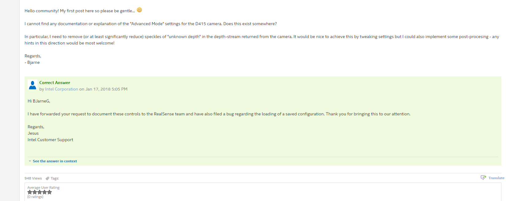

# Advanced Mode Parameters (Depth Stream)

librealsense 버전 2.10.0 에 새롭게 advanced_mode preset 이 추가되었다. [링크ㅜㅜ](https://github.com/IntelRealSense/librealsense/blob/v2.10.0/src/ds5/advanced_mode/presets.cpp)  
*(현재 사용중인 리얼센스 라이브러리의 버전은 2.9.0)*

2.10.0 에 추가된 advanced_mode preset을 보면
* D400, D420 - 63개  
* D405, D410, D430 - 65개  

개로 적혀져있다. ~~415는 없다.~~   
2개의 차이는  `p.laser_state.laser_state = 1;` 과 `p.laser_power.laser_power = 150.f;` 가 있느냐/없느냐 차이이다. 이는 IR projector의 유무로 결정되는것으로 추측된다. (장비별 프로젝터 탑재 여부는 assets 폴더 하위의 Intel-Realsense-D40-Series-Datasheet.pdf 를 참고하자)  

넘버링이 가장 유사한 D410을 가지고 프리셋을 분석하면 될것 같다.
우선 장비의 advanced_mode 를 활성화 시키기 위해서는 cmake 단계에서 `-DBUILD_RS400_EXTRAS=true` 옵션을 주고 빌드하면 된다고 하지만 안된다. 한참을 헤메다 커뮤니티를 찾아보니, 버그인것으로 보인다.

 * 2.9.0 advanced_mode 컴파일 문의 : https://communities.intel.com/thread/121550?q=advanced
 * Building Advanced Mode APIs : https://github.com/IntelRealSense/librealsense/blob/v2.9.0/doc/rs400/rs400_advanced_mode.md

차후 분석을 위해 프리셋 링크를 걸어놓고
[v 2.10.0 preset 링크](https://github.com/IntelRealSense/librealsense/blob/f11482ddc645594f12dc003044db74e1c1895b13/src/ds5/advanced_mode/presets.cpp#L146) , librealsense 에 동봉된 `realsense-viewer` 프로그램을 이용해 아래와 같이 Depth Stream 에 적용가능한 parameter 들을 적어보았다. 아직까지는 각 파라미터들이 어떠한 기능을 하는지 알 수 없다. ~~설명되어있는 문서가 아무리 찾아도 없다.~~

## Depth Control
1. DS Second Peak Threshold
2. DS Neighbor Threshold
3. DS Median Threshold
4. Estimate Median Increment
5. Estimate Median Decrement
6. Score Minimum Threshold
7. Score Maximum Threshold
8. DS LR Threshold
9. Texture Cunt Threshold
10. Dexture Difference Threshold

## RSM
1. RSM bypass
2. Disparity Difference Threshold
3. SLO RAU Difference Threshold
4. Remove Threshold

## Rau Support Vector Control
1. Min West
2. Min East
3. Min WE Sum
4. Min North
5. Min South
6. Min NS sum
7. U shrink
8. V shrink

## Color Control
1. Disable SAD color
2. Disable RAU color
3. Disable SLO Right color
4. Disable SLO Left color
5. Disable SAD Normalize

## Rau Color Thresholds Control
1. Diff Threshold Red
2. Diff Threshold Green
3. Diff Threshold Blue

## SLO Color Thresholds Control
1. Diff Threshold Red
2. Diff Threshold Green
3. Diff Threshold Blue

## SLO Penalty Control
1. K1 Penalty
2. K2 Penalty
3. K1 Penalty Mod1
4. K1 Penalty Mod2
5. K2 Penalty Mod1
6. K2 Penalty Mod2

## HDAD
1. Ignore SAD
2. AD Lambda
3. Census Lambda

## Color Correction
1. Color Correction **1~12**

## Depth table
1. Depth Units
2. Depth Clamp Min
3. Depth Clamp Max
4. Disparity Mode
5. Disparity Shift

## AE Control
1. Mean Intensity Set Point

## Sensus Enable Reg
1. u-Diameter
2. v-Diameter
