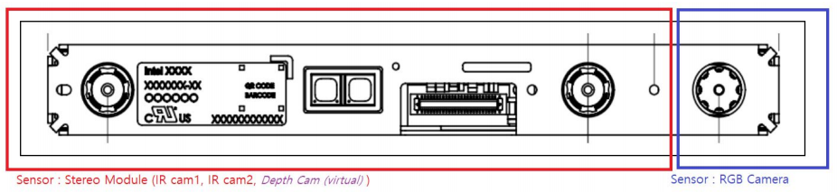
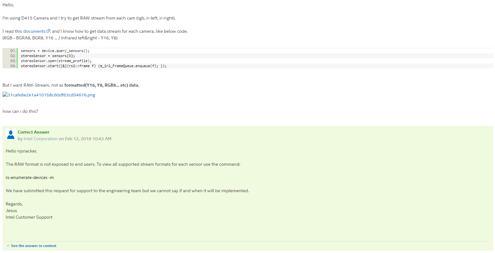
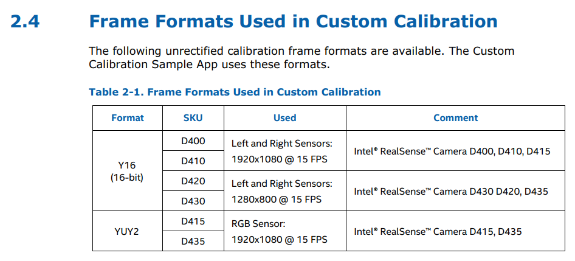

### 리얼센스 D415 장치구성 (센서, 스트림)


D415는 2개의 **"센서"** (**RGB_CAMERA**, **STEREO_MODULE**) 로 구성되고, 총 4개의 하드웨어 부품을 가지고 있다. (rgb camera, ir camera(left), ir camera(right), ir projector)  
하드웨어 자체에 접근하는 일은 ir 프로젝트를 조정하는일 말곤 거의 없을것으로 보이며 ~~접근방법도 잘 안나와있다.~~, 센서-스트림을 적극적으로 쓸것으로 보인다.

위 사진처럼 RGB_CAMERA 센서는 rgb camera 하드웨어를 포함, STEREO_MODULE 센서는 ir 카메라 2대와 projector 를 포함한다.  

각 센서별로 아래와 같은 **Stream** 을 얻는것이 가능하며 이 스트림으로부터 촬영 데이터를 얻을 수 있다.  
* Sensor::RGB_CAMERA = { Color0 }  
* Sensor::STEREO_MODULE = { Infrared0, Infrared1, Infrared2, Depth0 }    

여기서 Infrared1 은 왼쪽 IR카메라 스트림 , Infrared2는 오른쪽 IR카메라 스트림 이다. Infrared0은 해상도가 1280x720 인것으로 보아 IR1&2 를 합친 스트림으로 보인다.

<br>
### 센서접근

장치의 센서에 접근하는 방법은 다음과 같다. ~~(realsense 기초 사용법을 먼저 보고오자)~~

```  
/* 장치의 센서별 접근 */
rs2::context ctx;
rs2::device_list list = ctx.query_devices();
rs2::device dev = list[0];
vector<rs2::sensor> = device.query_sensors();
rs2::sensor stereo_sensor = sensor[0];
rs2::sensor color_sensor = sensor[1];
```
각 센서객체를 얻어왔다면 다음과 같이 **stream_profile** 을 주어, 스트림활성화를 시킬 수 있다. 마지막줄 `frame.get_data();` 를 통해 촬영 데이터를 얻어온다.
```
/* 센서별 스트림 활성화 및 데이터 get */
auto sensor = streo_sensor;
sensor.open(stream_profile)
sensor.start([&](rs2::frame f) {frame_queue.enqueue(f)}
rs2::frame frame = frame_queue.wait_for_frame();
auto data = frame.get_data(); //frame data get
```
stream_profile 은 `rs2::stream_profile` 클래스 이며, 각 스트림마다 이용가능한 stream_profile이 사전에 정해져있다. (Definition 링크는 [hot_link.md](./hotlink.md) 를 참조)  
이를 벗어난 스트림 프로파일을 사용하려고 하면 예외가 발생한다. 각 스트림마다 이용가능한 stream_profile 은 [stream_profile.md](./stream_profile) 에 정리해 두었으니 참고바란다.  

<br>
### Frame lifetime & sync
프레임의 관리와 생명주기, 메타데이터는 librealsense 에 잘 설명되어있어 링크로 대체한다.  
[Frame Management](https://github.com/IntelRealSense/librealsense/blob/v2.9.0/doc/frame_lifetime.md) - Frame Memory Management, Threading Model and Synchronization  
[Frame Metadata](https://github.com/IntelRealSense/librealsense/blob/v2.9.0/doc/frame_metadata.md) - Support for frame-metadata attributes  

<br>
### RaW 스트림?
RAW 스트림을 얻을 수 있느냐? 라고 문의를 했지만, 제공해주지 않는다는 답변을 받았다. [링크](https://communities.intel.com/thread/122385?q=RAW)



RAW 데이터는 IR카메라 10bit, RGB카메라 10bit 로 적혀있다. *( Intel-RealSense-D40-Series-Datasheet / 3.6.1 Left and Right Imagers, 3.6.1 Left and Right Imagers )*

하지만 RealSense_D400_Custom_Calib_Paper.pdf 문서에서 아래 그림과같은 포멧은 변형되지 않았다고 하니, 해당 스트림데이터를 RAW 데이터로 여기는것이 최선으로 보인다.


